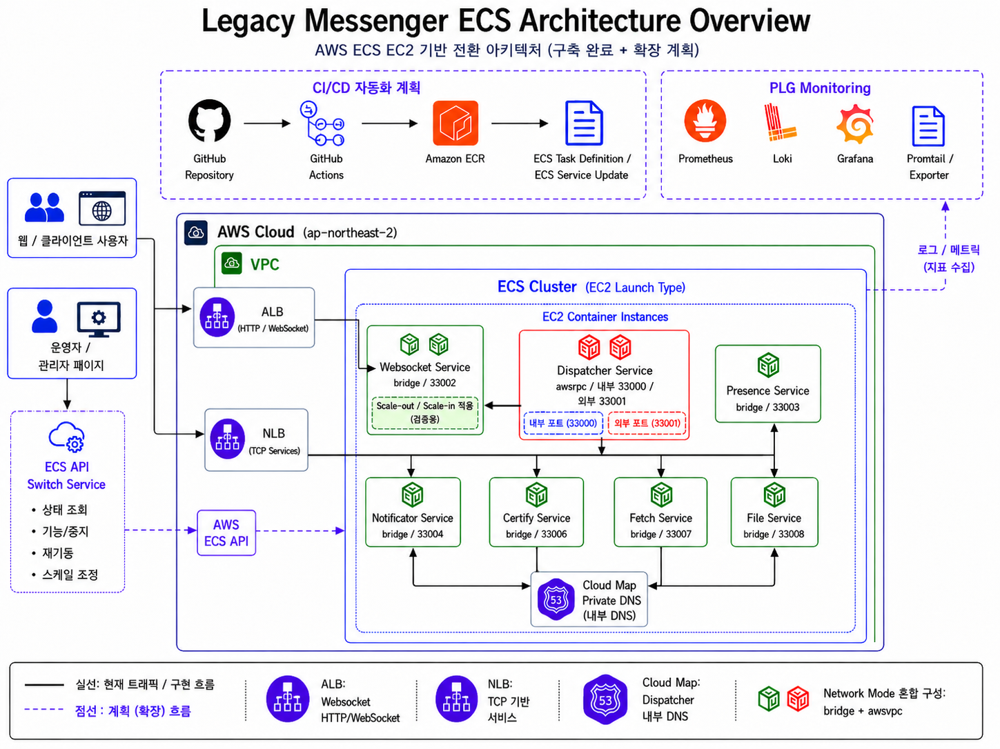

# Legacy Messenger ECS Ops POC

기존 온프레미스 Java 메신저 서비스를 AWS ECS EC2 기반 컨테이너 운영 구조로 전환하면서,
Docker 이미지화, ALB/NLB 분리, Cloud Map 내부 DNS, ECS Service 운영 제어, 주요 장애 케이스 분석까지 검증한 인프라 전환 POC입니다.

## Summary

| 구분       | 내용                                                                                  |
| -------- | ----------------------------------------------------------------------------------- |
| 대상 시스템   | 온프레미스 기반 Java 메신저 서비스                                                               |
| 기존 운영 방식 | 서버별 jar 배포, 프로세스 단위 수동 실행/중지/재기동                                                    |
| 전환 목표    | ECS Service, Task Definition, Load Balancer, Cloud Map 기반 운영 구조 검증                  |
| 주요 구성    | ECS EC2, ECR, ALB, NLB, Cloud Map, 운영 스크립트                                          |
| 검증 범위    | 서비스 기동, 로드밸런서 연동, 내부 DNS 접근, Target Health, 운영 제어                                   |
| 주요 이슈    | ENI 부족, Network Mode 재설계, Cloud Map SRV 호환성, NLB Multi-AZ Timeout, Target unhealthy |

## Architecture

## What I Implemented

| Area              | Summary                                                            |
| ----------------- | ------------------------------------------------------------------ |
| Containerization  | 기존 Java 서비스를 Docker 이미지로 패키징                                       |
| Image Registry    | AWS ECR 기반 이미지 관리                                                  |
| ECS Runtime       | ECS EC2 Cluster, Task Definition, ECS Service 구성                   |
| Load Balancing    | HTTP/WebSocket 요청은 ALB, TCP 기반 서비스는 NLB로 분리                        |
| Service Discovery | Dispatcher 내부 접근을 위해 Cloud Map A Record 기반 구조 검토                   |
| Operation         | desired count 변경, force deployment, target health check 스크립트 구성    |
| Troubleshooting   | Network Mode, Cloud Map, NLB Multi-AZ, Target Health 관련 이슈 분석 및 해결 |

## Key Architecture Decisions

| Decision              | Reason                                      |
| --------------------- | ------------------------------------------- |
| ECS EC2 기반 구성         | 기존 Java 서비스의 포트 사용 방식, 파일 마운트, 운영 제약을 고려    |
| ALB / NLB 분리          | HTTP/WebSocket 요청과 TCP 기반 서비스 접근 방식을 분리     |
| Dispatcher awsvpc 적용  | Cloud Map A Record 기반 내부 접근을 안정적으로 구성하기 위함  |
| 일부 서비스 bridge mode 적용 | 제한된 EC2 환경에서 다수 서비스 실행과 scale-out 검증을 함께 고려 |
| 운영 스크립트 구성            | ECS 콘솔 의존도를 줄이고 반복 운영 작업을 명령어로 표준화          |

자세한 설계 판단은 [`docs/02-architecture.md`](./docs/02-architecture.md)에서 확인할 수 있습니다.

## Troubleshooting Highlights

| 문제                              | 주요 원인                                                                       | 해결 방향                                                                 | 상태    |
| ------------------------------- | --------------------------------------------------------------------------- | --------------------------------------------------------------------- | ----- |
| awsvpc ENI 부족과 Network Mode 재설계 | 모든 서비스를 awsvpc로 구성할 경우 Task별 ENI가 필요하여 제한된 EC2 환경에서 다수 서비스 실행에 제약 발생        | 대부분의 서비스는 bridge mode로 구성하고, 내부 DNS 고정 접근이 필요한 Dispatcher만 awsvpc로 분리 | 해결    |
| Cloud Map SRV Record 호환 문제      | SRV Record는 host:port 해석이 필요하지만 기존 레거시 서비스는 Hostname/IP 기반 접근을 전제로 동작       | Dispatcher를 awsvpc mode로 구성하고 Cloud Map A Record 기반 접근으로 조정           | 해결    |
| NLB Multi-AZ timeout 분석         | NLB DNS가 여러 AZ IP로 응답하지만 특정 AZ에 healthy target이 없는 경우 일부 IP 접근 시 timeout 발생 | Target Group health, AZ별 target 배치 상태, NLB 연결 구조를 분석하여 원인 확인          | 분석 완료 |
| ALB/NLB Target unhealthy        | Health Check path 불일치, Security Group 인바운드 누락, Target Group 포트 설정 오류        | Health Check 경로, 서비스 응답, Target Group 포트, Security Group 규칙 조정        | 해결    |

자세한 원인 분석과 검증 과정은 [`docs/05-troubleshooting.md`](./docs/05-troubleshooting.md)에 정리했습니다.

## Validation Evidence

| 검증 항목          | 확인 내용                                              |
| -------------- | -------------------------------------------------- |
| ECS Service 실행 | 주요 서비스 desired count 기반 기동 확인                      |
| ALB/NLB 연동     | Target Group healthy 상태 확인                         |
| 내부 DNS 접근      | Dispatcher Cloud Map A Record 기반 접근 검토             |
| 서비스 포트 연결      | nc / curl 기반 포트 및 응답 확인                            |
| 운영 스크립트        | scale, force deployment, target health check 명령 검증 |

관련 스크린샷, 로그, 테스트 결과는 [`evidence/`](./evidence/) 디렉터리에 정리했습니다.

## Operation Scripts

ECS 운영 중 반복적으로 수행하는 서비스 상태 확인, desired count 변경, 강제 재배포, Target Group 상태 확인, 포트 연결 검증 작업을 스크립트로 정리했습니다.

| Script | Purpose |
| --- | --- |
| [`describe-service.sh`](./scripts/describe-service.sh) | ECS Service의 desired/running/pending 상태와 Task Definition 확인 |
| [`scale-service.sh`](./scripts/scale-service.sh) | ECS Service의 desired count 변경 |
| [`force-new-deployment.sh`](./scripts/force-new-deployment.sh) | ECS Service에 force new deployment 실행 |
| [`check-target-health.sh`](./scripts/check-target-health.sh) | ALB/NLB Target Group의 target health 상태 확인 |
| [`test-port-connectivity.sh`](./scripts/test-port-connectivity.sh) | 특정 host/port에 대한 TCP 연결 확인 |

자세한 사용 방식은 [`scripts/README.md`](./scripts/README.md)에 정리했습니다.

## Documentation

상세 구성과 검증 과정은 아래 문서에 정리했습니다.

| Document                                                        | Description         |
| --------------------------------------------------------------- | ------------------- |
| [`01-overview.md`](./docs/01-overview.md)                       | 프로젝트 개요와 구성 범위      |
| [`02-architecture.md`](./docs/02-architecture.md)               | ECS 아키텍처와 주요 설계 판단  |
| [`03-deployment-flow.md`](./docs/03-deployment-flow.md)         | 배포 흐름 전환 과정|
| [`04-operation-scenarios.md`](./docs/04-operation-scenarios.md) | ECS 운영 시나리오         |
| [`05-troubleshooting.md`](./docs/05-troubleshooting.md)         | 주요 문제 원인과 해결 과정     |
| [`06-result-summary.md`](./docs/06-result-summary.md)           | POC 결과 요약           |

## Security 

본 저장소에는 실제 운영 계정 정보, 보안 키, 내부 도메인, 민감한 설정 파일은 포함하지 않았습니다.

Task Definition, 설정 예시, 로그, 스크린샷은 포트폴리오 공개를 위해 필요한 범위에서 마스킹하거나 재구성했습니다.
