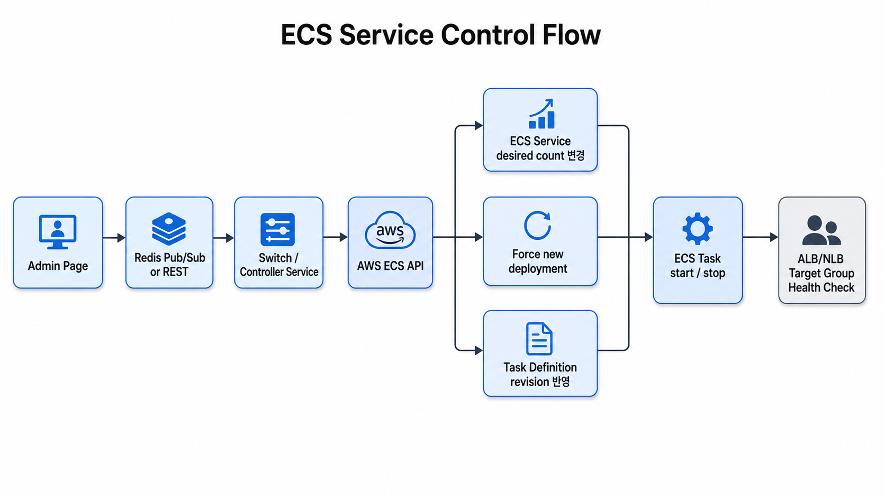
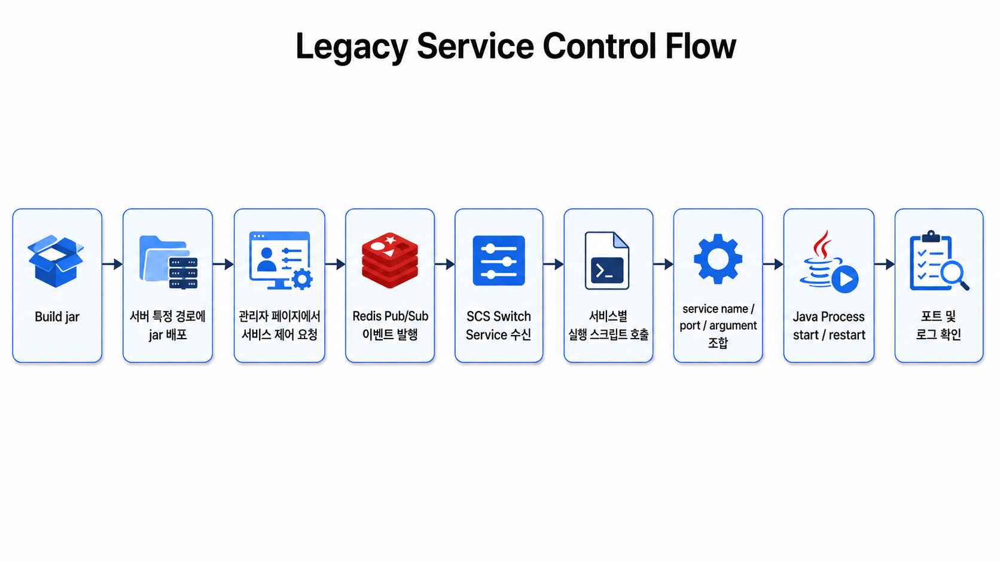
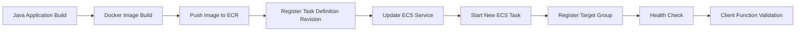
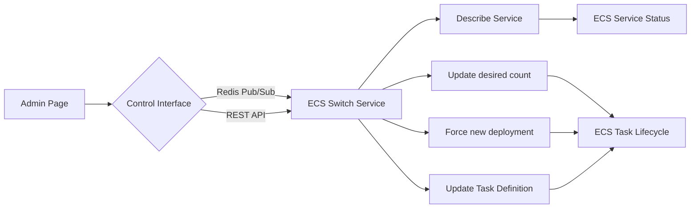
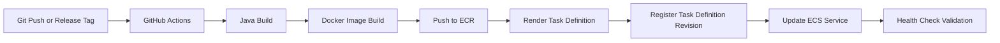

# 03. Deployment Flow

## 1. 배포 및 운영 제어 흐름 개요

본 문서는 기존 레거시 메신저 서비스의 배포 및 서비스 기동/재기동 흐름을 ECS 환경에서 어떻게 전환했는지 정리합니다.

기존 운영 구조에서는 Java jar 파일을 서버의 특정 경로에 배포한 뒤, 관리자 페이지에서 서비스 기동 또는 재기동 명령을 수행했습니다. 관리자 페이지는 직접 서버 프로세스를 제어하지 않고, Redis Pub/Sub을 통해 `scs`라고 불리는 Switch Service에 이벤트를 전달했습니다.

`scs` 서버는 수신한 이벤트를 기준으로 서비스별로 정의된 실행 스크립트를 호출하고, 해당 스크립트는 서비스명, 포트, 실행 인자를 조합하여 Java 프로세스를 기동하는 구조였습니다.

ECS 전환 후에는 이 구조를 그대로 서버 프로세스 제어 방식으로 유지하지 않고, 다음과 같이 역할을 전환하는 방향으로 검토했습니다.



즉, 기존 구조의 핵심은 유지하되, 제어 대상이 서버의 Java 프로세스와 shell script에서 ECS Service와 Task로 변경됩니다.

---

## 2. 기존 SCS 기반 배포 및 기동 구조

기존 서비스는 동일한 Java jar를 기반으로 실행되며, 서비스별 역할은 실행 시 전달되는 서비스명, 포트, 실행 인자에 의해 결정되었습니다.

기존 배포 및 기동 흐름은 다음과 같습니다.



기존 구조에서 `scs`는 관리자 페이지와 실제 서비스 프로세스 사이의 제어 계층 역할을 수행했습니다.

| 구성 요소              | 역할                                                        |
| ------------------ | --------------------------------------------------------- |
| 관리자 페이지            | 사용자가 서비스 기동, 중지, 재기동 요청을 수행하는 웹 UI                        |
| Redis Pub/Sub      | 관리자 페이지의 제어 이벤트를 SCS로 전달                                  |
| SCS Switch Service | 이벤트를 수신하고 서비스별 실행 스크립트를 호출                                |
| 실행 스크립트            | 서비스명, 포트, 실행 인자를 조합하여 Java 프로세스 실행                        |
| Java Process       | Websocket, Dispatcher, Certify, Notificator 등 실제 서비스 프로세스 |

이 방식은 기존 온프레미스 환경에서는 단순하고 직접적인 제어가 가능하다는 장점이 있었습니다. 하지만 서비스 실행 상태가 서버 프로세스와 스크립트에 강하게 의존하기 때문에, 컨테이너 기반 배포, 오토스케일링, Task 단위 상태 관리와는 잘 맞지 않는 한계가 있었습니다.

---

## 3. 기존 구조의 한계

기존 SCS 기반 구조는 관리자 페이지에서 서비스 제어를 수행할 수 있다는 장점이 있었지만, 운영 자동화와 확장성 측면에서는 다음과 같은 한계가 있었습니다.

| 한계          | 설명                                       |
| ----------- | ---------------------------------------- |
| 서버 의존성      | jar 파일이 배포된 서버 경로와 실행 스크립트에 의존           |
| 프로세스 단위 관리  | 서비스 상태를 Java 프로세스 단위로 확인하고 제어            |
| 수동 배포 의존    | jar 파일 반영, 스크립트 실행, 로그 확인 절차가 수동 작업에 가까움 |
| 배포 이력 관리 부족 | 어떤 jar 버전이 어떤 서버에 반영되었는지 추적하기 어려움        |
| 오토스케일링 부재   | 트래픽 변화에 따라 서비스 인스턴스를 자동 증감하기 어려움         |
| 헬스체크 연동 부족  | 서비스 상태 확인이 포트, 로그, 프로세스 확인에 의존           |
| 롤백 절차 불명확   | 이전 jar 또는 이전 실행 상태로 되돌리는 절차가 표준화되어 있지 않음 |

ECS 전환의 목적은 기존 구조를 완전히 부정하는 것이 아니라, 기존의 서비스 제어 흐름을 ECS의 관리 단위에 맞게 재해석하는 것입니다.

---

## 4. ECS 기반 배포 흐름

ECS 전환 후에는 jar 파일을 서버에 직접 반영하는 대신, Docker Image를 배포 산출물로 사용합니다.

배포 흐름은 다음과 같습니다.



ECS 기반 배포에서는 기존의 `service name`, `port`, `script argument`가 다음 구성으로 대체됩니다.

| 기존 구조        | ECS 전환 후                                               |
| ------------ | ------------------------------------------------------ |
| jar 파일       | Docker Image                                           |
| 서버 특정 경로     | ECR Image Repository                                   |
| 실행 스크립트      | ECS Task Definition                                    |
| service name | ECS Service name                                       |
| port         | containerPort / hostPort / Target Group port           |
| Java Process | ECS Task                                               |
| SCS 재기동 명령   | ECS Service update / force new deployment              |
| 수동 프로세스 확인   | ECS Service status / Task status / Target Group health |

즉, 기존에는 SCS가 서버의 실행 스크립트를 호출했다면, ECS 환경에서는 Controller 또는 CI/CD 파이프라인이 ECS API를 호출하여 Service의 desired count, Task Definition revision, deployment 상태를 변경하는 방식으로 전환됩니다.

---

## 5. Task Definition과 기존 실행 인자 매핑

기존 서비스는 동일한 single jar를 사용하되, 실행 시점의 Main Class, 서비스명, 포트 인자에 따라 서비스 역할이 결정되었습니다.

ECS 전환 후에도 이 구조를 유지했습니다. 차이점은 실행 스크립트에 있던 실행 조건을 ECS Task Definition의 `entryPoint`, `command`, `portMappings`, `mountPoints`로 옮겼다는 점입니다.

예시는 다음과 같습니다.

```dockerfile
ENTRYPOINT ["java", "-Xms64m", "-Xmx192m", "-cp", "/app/app.jar", "각 서비스 별 Main Class"]
CMD ["ID", "서비스 명", "포트"]
```

ECS Task Definition에서는 서비스별로 다음 항목을 분리하여 관리합니다.

| 항목               | 설명                       |
| ---------------- | ------------------------ |
| image            | ECR에 push된 서비스 이미지       |
| entryPoint       | Java 실행 명령 및 Main Class  |
| command          | 서비스 ID, 서비스명, 포트 등 실행 인자 |
| portMappings     | 컨테이너 포트 및 호스트 포트         |
| mountPoints      | 설정 파일, 보안 키 등 외부 파일 마운트  |
| cpu / memory     | 서비스별 리소스 할당              |
| logConfiguration | 컨테이너 로그 수집 설정            |

이 방식은 기존 실행 구조를 크게 변경하지 않으면서도, 실행 단위를 서버 프로세스에서 ECS Task로 전환할 수 있다는 장점이 있습니다.

---

## 6. ECS Service Update 흐름

새로운 이미지가 ECR에 push되고 Task Definition revision이 등록되면, ECS Service를 업데이트하여 새로운 Task를 실행합니다.

```bash
aws ecs update-service \
  --cluster ucware-cluster \
  --service ucware-ws-service \
  --task-definition ucware-ws-task:<revision> \
  --region ap-northeast-2
```

이미지 변경 없이 기존 Task를 재기동하거나 설정 변경을 반영해야 하는 경우에는 `force-new-deployment`를 사용할 수 있습니다.

```bash
aws ecs update-service \
  --cluster ucware-cluster \
  --service ucware-ws-service \
  --force-new-deployment \
  --region ap-northeast-2
```

서비스 기동 또는 중지는 desired count 변경으로 처리할 수 있습니다.

```bash
aws ecs update-service \
  --cluster ucware-cluster \
  --service ucware-ws-service \
  --desired-count 1 \
  --region ap-northeast-2
```

```bash
aws ecs update-service \
  --cluster ucware-cluster \
  --service ucware-ws-service \
  --desired-count 0 \
  --region ap-northeast-2
```

기존 SCS 구조에서 `start`, `stop`, `restart`가 스크립트 호출이었다면, ECS에서는 다음과 같이 매핑됩니다.

| 기존 명령     | ECS 전환 후                                        |
| --------- | ----------------------------------------------- |
| start     | desired count를 1 이상으로 변경                        |
| stop      | desired count를 0으로 변경                           |
| restart   | force new deployment 또는 Task stop 후 Service 재기동 |
| redeploy  | 새로운 Task Definition revision으로 update-service   |
| scale out | desired count 증가                                |
| scale in  | desired count 감소                                |

---

## 7. 배포 상태 확인

ECS Service 업데이트 후에는 서비스 상태, 배포 상태, Task 실행 상태를 확인해야 합니다.

```bash
aws ecs describe-services \
  --cluster ucware-cluster \
  --services ucware-ws-service \
  --region ap-northeast-2 \
  --query "services[0].{
    service:serviceName,
    taskDef:taskDefinition,
    desired:desiredCount,
    running:runningCount,
    pending:pendingCount,
    deployments:deployments[*].{
      status:status,
      taskDef:taskDefinition,
      desired:desiredCount,
      running:runningCount,
      pending:pendingCount,
      rolloutState:rolloutState
    },
    events:events[0:5].message
  }"
```

정상 배포 여부는 다음 기준으로 확인합니다.

| 항목           | 정상 기준            |
| ------------ | ---------------- |
| desiredCount | 의도한 서비스 개수와 일치   |
| runningCount | desiredCount와 일치 |
| pendingCount | 0                |
| rolloutState | `COMPLETED`      |
| Target Group | `healthy`        |
| Client Test  | 로그인 및 주요 기능 정상   |

---

## 8. Target Group 및 Health Check 확인

ECS Service가 새로운 Task를 실행하면, 연결된 Target Group에 Task가 등록됩니다.

Websocket 서비스는 ALB Target Group을 통해 HTTP Health Check를 수행하고, TCP 기반 서비스는 NLB Target Group을 통해 포트 기반 Health Check를 수행합니다.

```bash
aws elbv2 describe-target-health \
  --target-group-arn <target-group-arn> \
  --region ap-northeast-2
```

정상 상태에서는 Target Health가 `healthy`로 표시되어야 합니다.

| 상태        | 의미                            |
| --------- | ----------------------------- |
| initial   | Target 등록 후 Health Check 진행 중 |
| healthy   | 정상 응답                         |
| unhealthy | Health Check 실패               |
| draining  | 기존 Task 종료 또는 교체 중            |

Health Check 실패 시에는 다음 항목을 확인합니다.

| 점검 항목             | 확인 내용                                |
| ----------------- | ------------------------------------ |
| Port Mapping      | containerPort / hostPort 설정 확인       |
| Security Group    | Load Balancer에서 ECS Task로 접근 가능한지 확인 |
| Health Check Path | ALB Health Check 경로와 애플리케이션 응답 경로 확인 |
| Target Group      | 대상 서비스와 올바르게 연결되었는지 확인               |
| Application Log   | 컨테이너 내부 Java 애플리케이션 기동 오류 확인         |

---

## 9. Service Discovery 확인

Dispatcher 서비스는 내부 서비스들이 고정 DNS 이름으로 접근해야 하므로 Cloud Map 기반 Private DNS를 사용했습니다.

내부 서비스에서 Dispatcher 접근이 가능한지 다음 방식으로 확인했습니다.

```bash
getent hosts ds.ucware.local
```

정상적으로 DNS가 해석되면 Dispatcher Task의 Private IP가 반환됩니다.

```bash
172.31.xx.xx ds.ucware.local
```

내부 접근은 Cloud Map A Record 기반으로 구성하고, 외부 접근은 NLB Listener를 통해 분리했습니다.

| 구분        | 접근 방식              |  Port |
| --------- | ------------------ | ----: |
| 내부 서비스 접근 | Cloud Map A Record | 33000 |
| 외부 접근     | NLB Listener       | 33001 |

---

## 10. 기존 SCS 구조와 ECS 전환 매핑

기존 운영 구조를 ECS 기반 운영 구조로 전환할 때의 매핑은 다음과 같습니다.

| 기존 구성              | 역할                           | ECS 전환 후                                   |
| ------------------ | ---------------------------- | ------------------------------------------ |
| 관리자 페이지            | 서비스 제어 요청 UI                 | 기존 UI 유지 또는 API 연동                         |
| Redis Pub/Sub      | 제어 이벤트 전달                    | Redis Pub/Sub 유지 또는 REST API 전환            |
| SCS Switch Service | 서비스별 스크립트 호출                 | ECS Switch / Controller Service            |
| 실행 스크립트            | Java 프로세스 start/stop/restart | ECS API 호출                                 |
| service name       | 실행 대상 서비스 식별                 | ECS Service name                           |
| port               | 서비스 실행 포트                    | Task Definition portMapping / Target Group |
| Java Process       | 실제 실행 프로세스                   | ECS Task                                   |
| 서버 로그              | 프로세스 로그 확인                   | CloudWatch / PLG 로그                        |
| 프로세스 상태            | ps, netstat, port 확인         | ECS Service / Task / Target Health         |

이 매핑을 통해 기존 운영자가 사용하던 서비스 제어 흐름을 크게 바꾸지 않으면서도, 실제 실행 및 배포 제어는 ECS의 표준 관리 단위로 이전할 수 있습니다.

---

## 11. 향후 ECS Switch Service 전환 방향

기존 SCS 구조를 참조하여, ECS 환경에서는 별도의 Switch 또는 Controller Service를 구성할 수 있습니다.

관리자 페이지는 기존과 유사하게 Redis Pub/Sub 이벤트를 발행하거나, REST API 방식으로 Controller Service를 호출합니다. Controller Service는 이벤트를 해석하여 AWS ECS API를 호출합니다.



ECS Switch Service에서 제공할 수 있는 API는 다음과 같습니다.

| 기능                  | 설명                                        |
| ------------------- | ----------------------------------------- |
| service status      | ECS Service desired/running/pending 상태 조회 |
| start service       | desired count를 1 이상으로 변경                  |
| stop service        | desired count를 0으로 변경                     |
| restart service     | force new deployment 수행                   |
| scale service       | desired count 증가 또는 감소                    |
| redeploy service    | 특정 Task Definition revision으로 update      |
| target health check | Target Group healthy 상태 조회                |
| recent events       | ECS Service event 조회                      |

이 구조를 적용하면 기존 관리자 페이지의 서비스 제어 흐름을 유지하면서도, 내부 구현은 서버 스크립트 실행 방식에서 ECS API 기반 운영 방식으로 전환할 수 있습니다.

---

## 12. 향후 CI/CD 배포 파이프라인 전환 방향

운영 제어와 별개로, 애플리케이션 버전 배포는 GitHub Actions 기반 CI/CD로 자동화할 수 있습니다.

CI/CD 파이프라인의 목표 흐름은 다음과 같습니다.



ECS Switch Service와 CI/CD 파이프라인은 역할이 다릅니다.

| 구분    | ECS Switch Service                     | CI/CD Pipeline                                      |
| ----- | -------------------------------------- | --------------------------------------------------- |
| 주요 목적 | 서비스 기동/중지/재기동/스케일 제어                   | 새 버전 배포 자동화                                         |
| 호출 주체 | 관리자 페이지 또는 운영자                         | GitHub Actions                                      |
| 입력 값  | service name, desired count, action    | git commit, image tag, task definition              |
| 주요 동작 | ECS desired count 변경, force deployment | Docker build, ECR push, Task Definition revision 등록 |
| 사용 시점 | 운영 중 서비스 제어                            | 코드 변경 또는 릴리즈 시점                                     |

따라서 본 POC의 후속 구조는 두 방향으로 확장됩니다.

1. 관리자 페이지 기반 운영 제어는 ECS Switch Service로 전환
2. 애플리케이션 버전 배포는 GitHub Actions CI/CD로 자동화

---

## 13. 정리

본 배포 흐름에서는 기존 jar 파일 직접 배포와 SCS 기반 서비스 제어 구조를 ECS 환경에서 어떻게 대체할 수 있는지 검토했습니다.

기존에는 관리자 페이지가 Redis Pub/Sub으로 SCS에 이벤트를 전달하고, SCS가 서비스별 실행 스크립트를 호출하여 Java 프로세스를 기동하는 구조였습니다. ECS 전환 후에는 이 흐름을 ECS Service, Task Definition, desired count, force deployment 중심으로 재구성했습니다.

이를 통해 다음 항목을 검증했습니다.

| 항목                                       | 결과       |
| ---------------------------------------- | -------- |
| 기존 single jar 실행 구조의 컨테이너화               | 검증 완료    |
| 서비스별 실행 인자의 Task Definition 반영           | 검증 완료    |
| ECR 기반 이미지 관리                            | 검증 완료    |
| ECS Service 기반 실행 관리                     | 검증 완료    |
| desired count 기반 start/stop 가능성          | 검증 완료    |
| force new deployment 기반 재기동 가능성          | 검증 가능    |
| Target Group Health Check 기반 상태 확인       | 검증 완료    |
| 기존 SCS 구조의 ECS Controller Service 전환 가능성 | 후속 진행 예정 |
| GitHub Actions CI/CD 기반 배포 자동화           | 후속 진행 예정 |

결과적으로 본 POC는 단순히 Java 서비스를 ECS에 올리는 작업이 아니라, 기존 SCS 기반 운영 제어 구조를 ECS의 서비스 관리 모델로 전환하기 위한 사전 검증이라는 의미가 있습니다.
