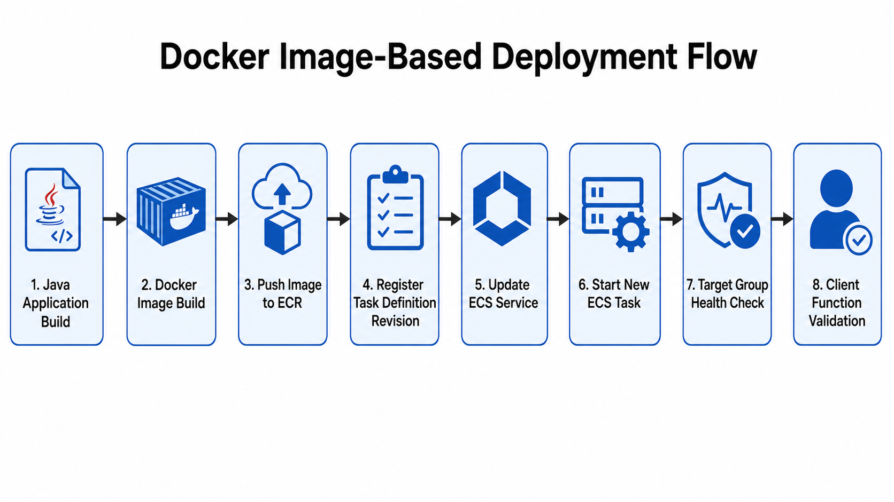

# 03. Deployment Flow

## 1. 배포 및 운영 제어 흐름 개요

기존 운영 구조에서는 Java jar 파일을 서버의 특정 경로에 배포한 뒤, 관리자 페이지에서 서비스 기동 또는 재기동 명령을 수행하는 방식으로 배포 및 운영되었습니다.
관리자 페이지에서 명령을 수행하면 Redis Pub/Sub을 통해 Switch 역할을 하는 서비스에 이벤트를 전달했습니다.

Switch 서비스에서 수신한 이벤트를 기준으로 서비스별로 정의된 실행 스크립트를 서비스명, 포트, 실행 인자를 조합하여 호출하고 요청에 맞는 Java 프로세스를 기동/중지하는 구조로 구성되어 있었습니다.

ECS 전환 후에는 관리자 페이지를 통한 서비스 제어 흐름은 유지하되, 실제 제어 대상은 서버의 Java 프로세스와 shell script가 아닌 ECS Service, Task, desired count, deployment로 전환하는 방향을 검토했습니다.

---

## 2. 기존 SCS 기반 배포 및 기동 구조

기존 서비스는 동일한 Java jar를 기반으로 실행되며, 서비스별 역할은 실행 시 전달되는 서비스명, 포트, 실행 인자에 의해 결정되었습니다.

기존 배포 및 기동 흐름은 다음과 같습니다.


기존 구조에서 Switch Service는 관리자 페이지와 실제 서비스 프로세스 사이의 제어 계층 역할을 수행했습니다.

| 구성 요소              | 역할                                                        |
| ------------------ | --------------------------------------------------------- |
| 관리자 페이지            | 사용자가 서비스 기동, 중지, 재기동 요청을 수행하는 웹 UI                        |
| Redis Pub/Sub      | 관리자 페이지의 제어 이벤트를 SCS로 전달                                  |
| Switch Service | 이벤트를 수신하고 서비스별 실행 스크립트를 호출                                |
| 실행 스크립트            | 서비스명, 포트, 실행 인자를 조합하여 Java 프로세스 실행                        |
| Java Process       | Websocket, Dispatcher, Certify, Notificator 등 실제 서비스 프로세스 |

---

## 3. 기존 구조의 한계

기존 구조는 관리자 페이지에서 서비스 제어를 수행할 수 있다는 장점이 있었지만, 운영 자동화와 확장성 측면에서는 다음과 같은 한계가 있었습니다.

| 한계          | 설명                                       |
| ----------- | ---------------------------------------- |
| 서버 의존성      | jar 파일이 배포된 서버 경로와 실행 스크립트에 의존           |
| 프로세스 단위 관리  | 서비스 상태를 Java 프로세스 단위로 확인하고 제어            |
| 수동 배포 의존    | jar 파일 반영, 스크립트 실행, 로그 확인 절차가 수동 작업에 가까움 |
| 배포 이력 관리 부족 | 어떤 jar 버전이 어떤 서버에 반영되었는지 추적하기 어려움        |
| 오토스케일링 부재   | 트래픽 변화에 따라 서비스 인스턴스를 자동 증감하기 어려움         |
| 헬스체크 연동 부족  | 서비스 상태 확인이 포트, 로그, 프로세스 확인에 의존           |
| 롤백 절차 불명확   | 이전 jar 또는 이전 실행 상태로 되돌리는 절차가 표준화되어 있지 않음 |

---

## 4. ECS 전환 방향

ECS 전환 후에는 ECS의 관리 단위에 맞게 다음과 같이 전환합니다.

| 구분     | 기존 구조              | ECS 전환 후                           |
| ------ | ------------------ | ---------------------------------- |
| 배포 산출물 | jar 파일             | Docker Image                       |
| 산출물 위치 | 서버 특정 경로           | Amazon ECR                         |
| 실행 정의  | 서비스별 shell script  | ECS Task Definition                |
| 실행 단위  | Java Process       | ECS Task                           |
| 서비스 관리 | SCS를 통한 script 호출  | ECS Service update                 |
| 기동/중지  | process start/kill | desired count 변경                   |
| 재기동    | script restart     | force new deployment               |
| 상태 확인  | ps, port, log 확인   | ECS Service, Task, Target Group 확인 |
| 확장     | 서버/프로세스 단위 수동 증설   | ECS Service desired count 기반 확장    |

즉, 기존 기존 구조의 핵심은 “관리자 페이지에서 서비스를 제어한다”는 운영 흐름이었습니다. ECS 전환 후에도 이 흐름은 유지할 수 있지만, 실제 제어 대상은 shell script와 Java Process가 아니라 ECS Service, Task Definition, desired count, deployment로 변경됩니다.

---

## 5. 기존 실행 스크립트와 Task Definition 매핑

기존 서비스는 동일한 single jar를 기반으로 실행되며, 서비스별 역할은 Main Class, 서비스명, 포트, 실행 인자 조합에 의해 결정되었습니다.

기존 실행 스크립트에서는 다음과 같은 정보를 조합하여 Java 프로세스를 실행했습니다.

| 기존 실행 요소     | 설명                   |
| ------------ | -------------------- |
| jar path     | 서버 특정 경로에 배포된 jar 파일 |
| Main Class   | 서비스별 실행 진입점          |
| service name | 실행 대상 서비스명           |
| port         | 서비스별 사용 포트           |
| argument     | 서비스 구분 및 실행 옵션       |
| config path  | 외부 설정 파일 경로          |

ECS 전환 후에는 이 실행 조건을 Task Definition에 반영했습니다.

```dockerfile
ENTRYPOINT ["java", "-Xms64m", "-Xmx192m", "-cp", "/app/app.jar", "각 서비스 별 Main Class"]
CMD ["ID", "서비스 명", "포트"]
```

Task Definition에서는 서비스별로 다음 항목을 관리합니다.

| Task Definition 항목 | 기존 구조에서 대응되는 요소                 |
| ------------------ | ------------------------------- |
| image              | jar 파일이 포함된 Docker Image        |
| entryPoint         | Java 실행 명령 및 Main Class         |
| command            | 서비스 ID, 서비스명, 포트 등 실행 인자        |
| portMappings       | 서비스별 port 설정                    |
| mountPoints        | config, security key 등 외부 파일 경로 |
| cpu / memory       | 서비스별 리소스 제한                     |
| logConfiguration   | 컨테이너 로그 출력 방식                   |

이 방식은 기존 single jar 기반 실행 구조를 크게 변경하지 않으면서, 실행 단위를 Java Process에서 ECS Task로 전환할 수 있다는 장점이 있습니다.

---

## 6. 이미지 기반 배포 흐름

ECS 전환 후에는 jar 파일을 서버에 직접 배포하지 않고, Docker Image를 배포 산출물로 사용합니다.

배포 흐름은 다음과 같습니다.



배포 단계별 역할은 다음과 같습니다.

| 단계                                | 설명                                    |
| --------------------------------- | ------------------------------------- |
| Java Application Build            | 기존 Java 애플리케이션 jar 생성                 |
| Docker Image Build                | jar와 실행 환경을 포함한 이미지 생성                |
| Push Image to ECR                 | ECS에서 참조할 수 있도록 ECR에 이미지 push         |
| Register Task Definition Revision | 신규 이미지 또는 실행 설정을 반영한 revision 생성      |
| Update ECS Service                | ECS Service가 새로운 revision을 사용하도록 업데이트 |
| Start New ECS Task                | ECS Scheduler가 새로운 Task 실행            |
| Target Group Health Check         | ALB/NLB Target Group에서 정상 여부 확인       |
| Client Function Validation        | 로그인, 채팅, 쪽지 등 기존 기능 검증                |

새로운 Task Definition revision을 ECS Service에 반영하는 예시는 다음과 같습니다.

```bash
aws ecs update-service \
  --cluster cluster \
  --service ws-service \
  --task-definition ws-task:<revision> \
  --region ap-northeast-2
```

이 흐름은 향후 GitHub Actions 기반 CI/CD 파이프라인으로 자동화할 수 있습니다.

---

## 7. ECS Service 기반 운영 제어 흐름

기존 SCS 구조에서는 서비스 start, stop, restart 요청이 실행 스크립트 호출로 이어졌습니다.

ECS 전환 후에는 동일한 운영 행위를 ECS Service의 desired count와 deployment 제어로 처리합니다.

| 운영 행위     | 기존 방식                                | ECS 전환 후                                     |
| --------- | ------------------------------------ | -------------------------------------------- |
| start     | 실행 스크립트로 Java Process 기동             | desired count를 1 이상으로 변경                     |
| stop      | Java Process 종료                      | desired count를 0으로 변경                        |
| restart   | script restart 또는 process kill 후 재기동 | force new deployment                         |
| redeploy  | jar 재배포 후 script 재기동                 | Task Definition revision 변경 후 update-service |
| scale out | 서버 또는 프로세스 수동 증설                     | desired count 증가                             |
| scale in  | 프로세스 수동 축소                           | desired count 감소                             |

서비스 기동 예시는 다음과 같습니다.

```bash
aws ecs update-service \
  --cluster cluster \
  --service ws-service \
  --desired-count 1 \
  --region ap-northeast-2
```

서비스 중지 예시는 다음과 같습니다.

```bash
aws ecs update-service \
  --cluster cluster \
  --service ws-service \
  --desired-count 0 \
  --region ap-northeast-2
```

서비스 재기동 또는 현재 Task 재배포는 다음과 같이 처리할 수 있습니다.

```bash
aws ecs update-service \
  --cluster cluster \
  --service ws-service \
  --force-new-deployment \
  --region ap-northeast-2
```

이 구조를 적용하면 기존 관리자 페이지의 서비스 제어 개념을 유지하면서도, 실제 제어 방식은 ECS의 표준 운영 모델로 전환할 수 있습니다.

---

## 8. 배포 및 운영 후 검증 기준

ECS Service 업데이트 또는 desired count 변경 후에는 서비스가 정상적으로 반영되었는지 확인해야 합니다.

검증 기준은 다음과 같습니다.

| 검증 항목           | 확인 내용                            | 정상 기준                          |
| --------------- | -------------------------------- | ------------------------------ |
| ECS Service 상태  | desired/running/pending count 확인 | runningCount가 desiredCount와 일치 |
| Deployment 상태   | rolloutState 확인                  | `COMPLETED`                    |
| Task 상태         | 신규 Task 실행 여부 확인                 | `RUNNING`                      |
| Target Group 상태 | ALB/NLB Target Health 확인         | `healthy`                      |
| 내부 DNS          | Cloud Map DNS 확인                 | `ds.service.local` 해석 가능        |
| 클라이언트 기능        | 로그인, 채팅, 쪽지 등 기능 확인              | 정상 동작                          |

ECS Service 상태 확인 예시는 다음과 같습니다.

```bash
aws ecs describe-services \
  --cluster cluster \
  --services ws-service \
  --region ap-northeast-2
```

Target Group 상태 확인 예시는 다음과 같습니다.

```bash
aws elbv2 describe-target-health \
  --target-group-arn <target-group-arn> \
  --region ap-northeast-2
```

Dispatcher 내부 DNS 확인 예시는 다음과 같습니다.

```bash
getent hosts ds.service.local
```

---

## 9. 후속 확장 방향

본 POC의 후속 확장 방향은 크게 두 가지입니다.

첫 번째는 기존 SCS 구조를 참조하여 ECS Switch Service를 구축하는 것입니다. 관리자 페이지는 기존처럼 Redis Pub/Sub으로 이벤트를 전달하거나, REST API 방식으로 호출할 수 있도록 작업할 계획입니다. Switch Service는 요청을 해석하여 ECS API를 호출합니다.


ECS Switch Service의 역할은 다음과 같습니다.

| 기능                  | 설명                                        |
| ------------------- | ----------------------------------------- |
| service status      | ECS Service desired/running/pending 상태 조회 |
| start service       | desired count를 1 이상으로 변경                  |
| stop service        | desired count를 0으로 변경                     |
| restart service     | force new deployment 수행                   |
| scale service       | desired count 증가 또는 감소                    |
| redeploy service    | 특정 Task Definition revision으로 update      |
| target health check | Target Group healthy 상태 조회                |
| recent events       | ECS Service event 조회                      |

두 번째는 GitHub Actions 기반 CI/CD 파이프라인 구축입니다.

CI/CD 파이프라인은 운영 중 서비스 제어보다는 새 버전 배포 자동화를 목적으로 합니다.

ECS Switch Service와 CI/CD 파이프라인의 역할은 다음과 같이 구분됩니다.

| 구분    | ECS Switch Service                  | CI/CD Pipeline                               |
| ----- | ----------------------------------- | -------------------------------------------- |
| 목적    | 운영 중 서비스 제어                         | 새 버전 배포 자동화                                  |
| 호출 주체 | 관리자 페이지 또는 운영자                      | GitHub Actions                               |
| 입력 값  | service name, action, desired count | git commit, image tag, task definition       |
| 주요 동작 | desired count 변경, force deployment  | build, ECR push, task definition revision 등록 |
| 사용 시점 | 기동, 중지, 재기동, 스케일 조정                 | 코드 변경 또는 릴리즈 시점                              |

즉, ECS Switch Service는 운영 제어를 담당하고, CI/CD Pipeline은 버전 배포를 담당합니다.

---

## 10. 정리

본 문서에서는 기존 jar 배포와 SCS 기반 서비스 제어 구조를 ECS 환경에서 어떻게 전환할 수 있는지 정리했습니다.

기존에는 관리자 페이지가 Redis Pub/Sub으로 Switch Service에 이벤트를 전달하고, Switch Service가 서비스별 실행 스크립트를 호출하여 Java 프로세스를 기동/중지하는 구조였습니다.

ECS 전환 후에는 이 흐름을 다음과 같이 재구성했습니다.

| 기존 구조        | ECS 전환 후                                  |
| ------------ | ----------------------------------------- |
| jar 파일 배포    | Docker Image / ECR 기반 배포                  |
| 실행 스크립트      | Task Definition                           |
| Java Process | ECS Task                                  |
| SCS 제어       | ECS Service update                        |
| start / stop | desired count 변경                          |
| restart      | force new deployment                      |
| 상태 확인        | ECS Service / Task / Target Group 확인      |
| 향후 자동화       | ECS Switch Service / GitHub Actions CI/CD |

또한, 추후 ECS Switch Service 및 CI/CD 파이프라인 구축을 진행할 예정입니다.

결과적으로 본 POC는 단순히 Java 서비스를 ECS에 올리는 작업이 아니라, 기존 SCS 기반 운영 제어 구조를 ECS Service 중심의 배포 및 운영 모델로 전환하기 위한 사전 검증이라는 의미가 있습니다.
